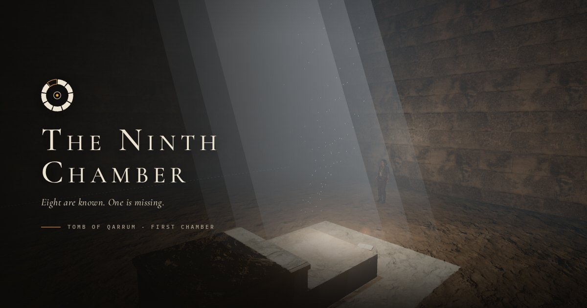
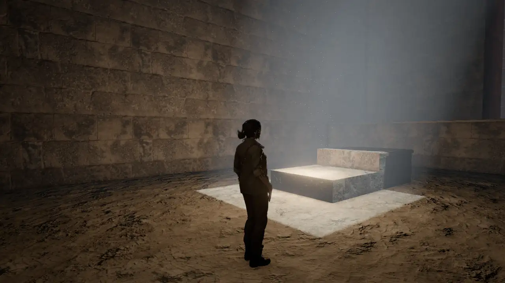
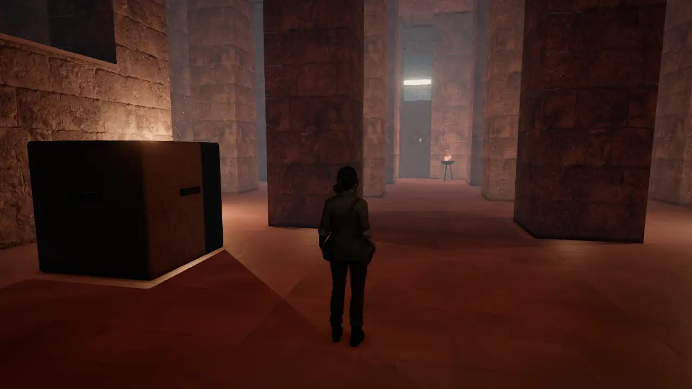
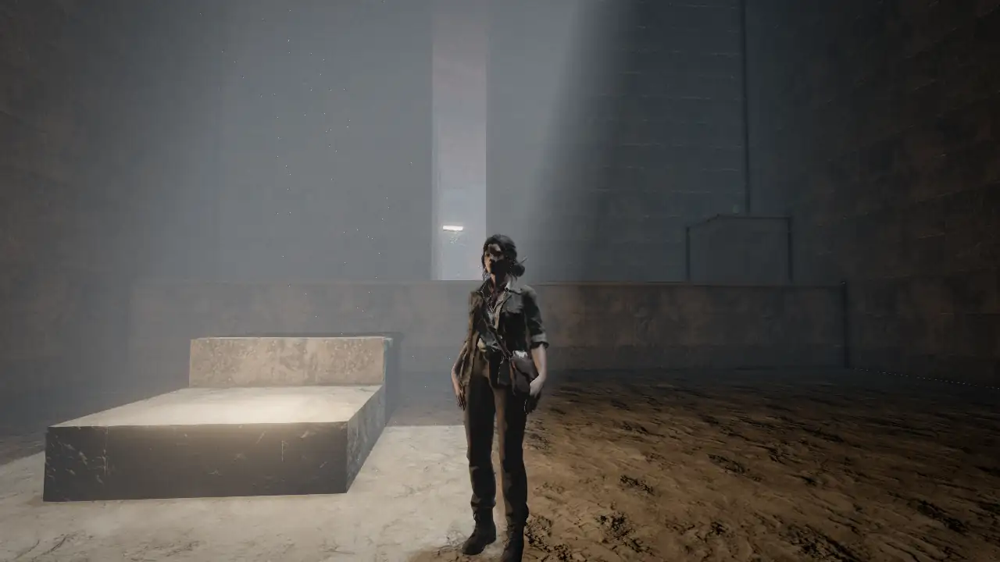
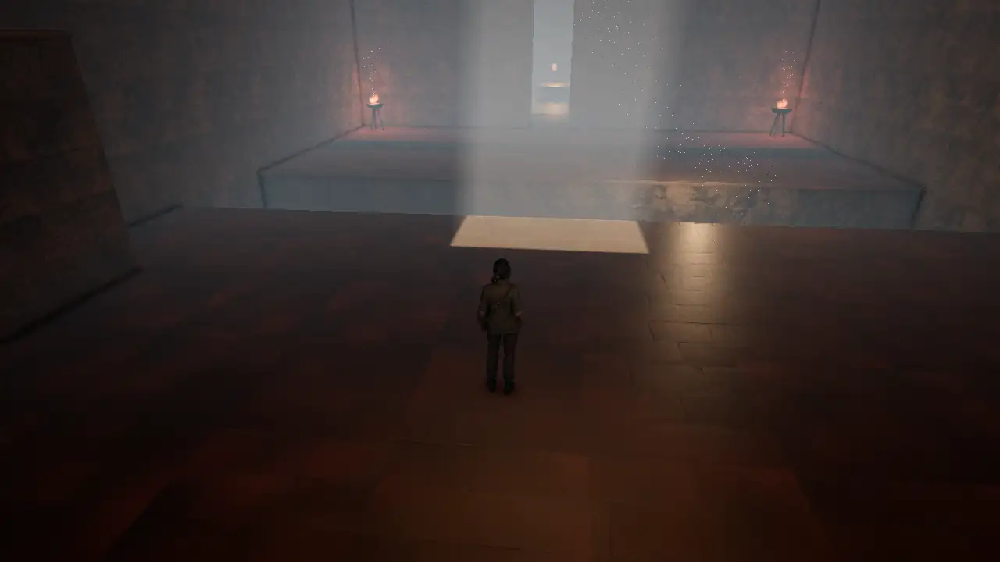

# The Ninth Chamber · La Novena Cámara



**[Play it in your browser →](https://ezar.github.io/ninth-chamber/)** (desktop, phone or gamepad; built from `main`)

A third-person tomb-exploration adventure for the browser, in the spirit of the classics of 1996–2000: read the architecture, move the stones, find the way, survive the tomb.

> Eight chambers are known, sealed with the same mark: a ring of nine segments. Eight are carved in the stone; the ninth is only an outline. In 1956 the Ferrand expedition entered the tomb of Qarrum. Only Elena Vidal came back, and she never told what she saw. Seventy years later the sand has opened the door again, and her granddaughter **Nora Vidal**, an archaeologist, follows Elena's notebooks inside.

|                                         |                                             |                                     |                                        |
| --------------------------------------- | ------------------------------------------- | ----------------------------------- | -------------------------------------- |
|  |  |  |  |

## What's in the game

- **Chamber I · The Antechamber:** ten rooms built around weight plates, timed gates, a sunlit well, a sunken causeway and the Chamber of Scales. It has three secrets, four journal notes and the Amber Heart at the end. Chambers II (**The Cisterns**) and III (**The Temple of the Sun**) are in progress.
- **Nora** is a scanned character with motion-captured animation (Mixamo clips made on her own mesh) and foot planting. She runs, jumps, grabs ledges, shimmies, climbs, pushes and pulls blocks, and draws dual pistols.
- **Combat:** jackals with perception, grid pathfinding and pack hunting; auto-aim pistols; medkits.
- **Puzzles as data:** levels are JSON grids with declarative `when → do` rules. A bot plays every level end to end in the test suite.
- **Look:**
  - Indirect light baked with Blender Cycles, and scanned CC0 textures.
  - Volumetric sun shafts, GTAO, bloom and a per-room grade.
  - Quality tiers with dynamic resolution, so it runs on phones.
- **Sound:**
  - Recorded footsteps, foley and ambience.
  - An adaptive orchestral score that reacts to exploration, tension, combat, chases and bosses, with stingers for discoveries.
  - Haptics on phones and gamepads.
- **Story:** a cinematic intro, journal notes, an end screen with a relic reveal, rank and best time, and a campaign across nine chambers.
- **Languages:** English and Spanish. The UI follows the browser and can be changed in Options.

## Controls

| Action                                         | Keyboard and mouse            | Gamepad           | Touch                                |
| ---------------------------------------------- | ----------------------------- | ----------------- | ------------------------------------ |
| Move                                           | WASD / arrows                 | Left stick        | Left-half stick (a light push walks) |
| Camera                                         | Drag the mouse, wheel to zoom | Right stick       | Drag on the right half               |
| Jump                                           | Space                         | A                 | Jump                                 |
| Action (grab, push/pull, lever, pick up, read) | E                             | X                 | Action                               |
| Walk (stops at edges)                          | Shift                         | LT                | Walk                                 |
| Fire (auto-aim)                                | F / right click               | RT                | Fire                                 |
| Draw / holster                                 | R                             | RB / LB           | Draw                                 |
| Next target                                    | Tab                           | D-pad right       |                                      |
| Medkit                                         | H                             | Y                 |                                      |
| Recenter camera                                | C                             | Right stick click |                                      |
| Pause                                          | Esc                           | Start             | ❚❚                                   |

## Development

Requires Node 22 and pnpm.

```sh
pnpm install
pnpm dev               # dev server
pnpm test              # Vitest: movement, mechanisms, combat, animation, music, full-level bot walkthroughs
pnpm lint              # ESLint (also enforces the simulation's purity rules)
pnpm typecheck         # types, plus the check that src/sim compiles without the DOM or Three.js
pnpm format            # Prettier
pnpm validate:levels   # schema and reachability checks for levels/*.level.json
pnpm build             # validate levels, typecheck and build to dist/
```

CI runs lint, format check, typecheck, tests and build on every PR. `main` is deployed to GitHub Pages.

### Architecture

| Folder        | What lives there                                                                                                                                                                                 |
| ------------- | ------------------------------------------------------------------------------------------------------------------------------------------------------------------------------------------------ |
| `src/sim/`    | The deterministic simulation: grid collision, Nora's state machine, mechanisms, enemies and level logic. It runs in Node, with a fixed 60 Hz step and seeded RNG; it has no Three.js and no DOM. |
| `src/render/` | Three.js (`WebGPURenderer` with WebGL2 fallback): level meshes, props, Nora, post-processing and quality tiers.                                                                                  |
| `src/audio/`  | The Web Audio engine: recorded sample banks, positional sound, reverbs and the adaptive music director.                                                                                          |
| `src/ui/`     | HUD, menus, loading, intro, journal reader, end screen and i18n (`i18n/*.json`).                                                                                                                 |
| `levels/`     | Level files: text-row grids with a legend, entities and rules, validated by `src/sim/grid/schema.ts`.                                                                                            |
| `art/looks/`  | Per-room lighting and grade.                                                                                                                                                                     |

The simulation emits events; render, audio and UI only listen. The rules for contributors, human or Claude Code, are in [CLAUDE.md](CLAUDE.md). The design spec is in [docs/spec.md](docs/spec.md) (Spanish).

### Asset pipelines

| Asset     | How it is built                                                                                                                                    |
| --------- | -------------------------------------------------------------------------------------------------------------------------------------------------- |
| Lightmaps | `scripts/bake/`: `export-level.ts` exports the level, then Blender Cycles bakes the indirect light with `bake_lightmap.py`.                        |
| Nora      | `scripts/character/rig_nora.py` turns the Meshy scan into a rigged, optimised GLB.                                                                 |
| Animation | `pnpm anim:build scripts/anim/sources/mixamo.json <folder>` retargets Mixamo FBX clips onto Nora ([docs/animation.md](docs/animation.md)).         |
| Props     | `scripts/blender/build_props.py` models and bakes the PBR prop kit in Blender.                                                                     |
| Audio     | `scripts/audio/build_audio.py` downloads, checks licences, trims, loops and normalises every sound and music cue ([docs/audio.md](docs/audio.md)). |

## Credits and licence

All third-party assets are CC0 or CC-BY, or were made for the project. The full list with authors and licences is in [CREDITS.md](CREDITS.md), and the game shows it on its Credits screen.

© 2026 César. All rights reserved for now; the licence is still an open decision ([docs/license.md](docs/license.md)). Progress notes are in [docs/changelog.md](docs/changelog.md).
